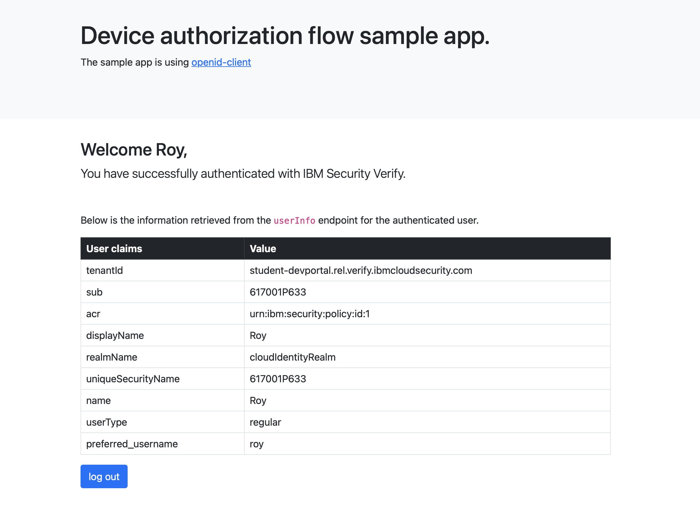

# Dev portal sample app for Device code flow.

This sample shows how to use the openid-client library with Node.js to:
- Authenticate a user via openid-client using the the device flow authorization grant type.
- Successfully make an API request to `userinfo` endpoint to return the authenticated users details.

## Running the sample app:
1. Configure your `.env` file variables. You can refer to the `.env.example` file with the required variables to run this sample.
3. From the CLI enter `npm install`
4. After successfully intalling node_modules, from the CLI start the sample application by running `npm run start`
4. navigate to `http://localhost:3000` in your browser and follow the on screen prompts to authenticate your app using the device flow authentication grant type with IBM Security Verify.

## User flow
- Click the `Device code` button to call the Authorization server to retrieve a valid device code.
- Copy the code and goto the provided link to authenticate using the device code
- The application begins polling the authorization server for a valid access token
- When the authentication process is complete you can view the authenticated users information.

## Troubleshooting
- CLI displaying `npm ERR! code E401` when trying to run `npm install`. Delete the package-lock.json file and run `npm install` again.

## License

The MIT License (MIT)

Copyright (c) 2023 - IBM Corp.

Permission is hereby granted, free of charge, to any person obtaining a copy of this software and associated documentation files (the "Software"), to deal in the Software without restriction, including without limitation the rights to use, copy, modify, merge, publish, distribute, sublicense, and/or sell copies of the Software, and to permit persons to whom the Software is furnished to do so, subject to the following conditions:

The above copyright notice and this permission notice shall be included in all copies or substantial portions of the Software.

THE SOFTWARE IS PROVIDED "AS IS", WITHOUT WARRANTY OF ANY KIND, EXPRESS OR IMPLIED, INCLUDING BUT NOT LIMITED TO THE WARRANTIES OF MERCHANTABILITY, FITNESS FOR A PARTICULAR PURPOSE AND NONINFRINGEMENT. IN NO EVENT SHALL THE AUTHORS OR COPYRIGHT HOLDERS BE LIABLE FOR ANY CLAIM, DAMAGES OR OTHER LIABILITY, WHETHER IN AN ACTION OF CONTRACT, TORT OR OTHERWISE, ARISING FROM, OUT OF OR IN CONNECTION WITH THE SOFTWARE OR THE USE OR OTHER DEALINGS IN THE SOFTWARE.